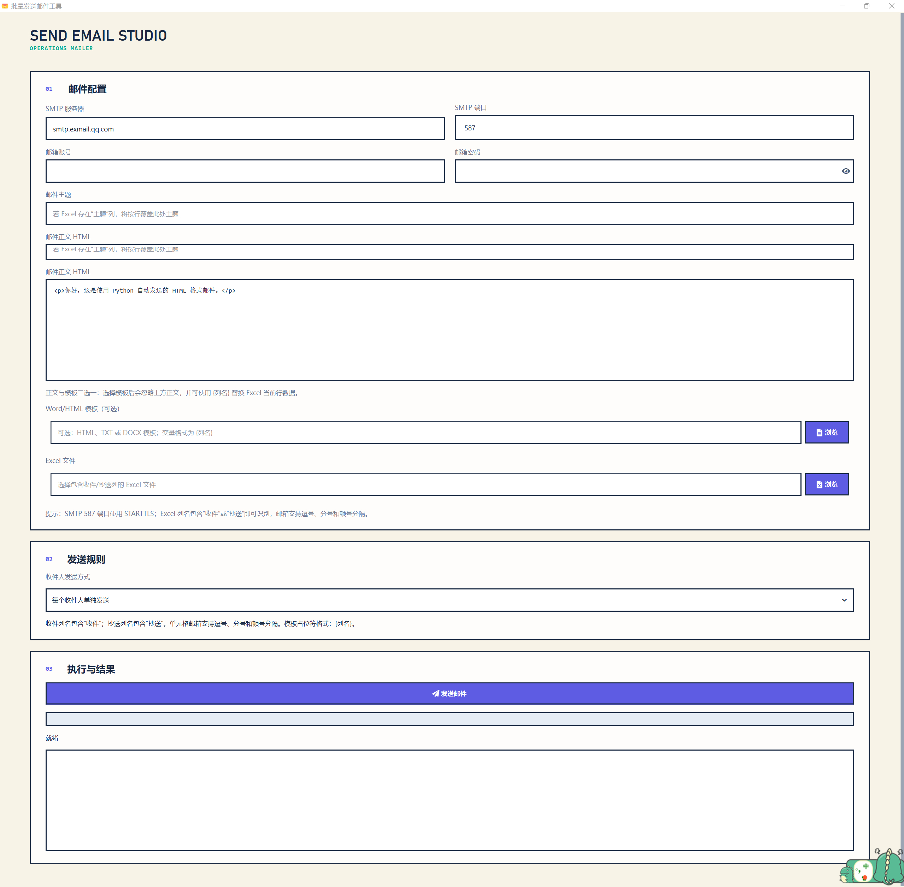

# Send Email Studio（批量邮件发送工具）

基于 Python + PySide6 分层桌面架构，具有正文/模板、Excel 数据替换、附件、SMTP 登录、后台发送、进度与日志功能。

## 项目预览



## 特色

- Excel 列名只要包含“收件”（兼容“收件人、收件邮箱、人员邮箱、员工邮箱”等）即可识别收件人。
- 单元格邮箱支持英文逗号、分号、中文顿号分隔，并自动去重、过滤无效地址。
- 可选择“每个收件人单独发送”或“一封邮件发送给全部收件人”。
- Excel 列名包含“抄送”时识别抄送人；抄送地址始终合并到同一封邮件。
- 列名包含“附件”时读取附件路径；正文支持 HTML 或 `.docx`/文本模板，模板变量使用 `{列名}`。
- Word 模板中的普通嵌入图片会以内嵌图片方式发送；建议在 Word/WPS 中将图片设置为“嵌入型/与文字排列”。

## 环境与启动

项目已创建 `.venv` 虚拟环境。PowerShell 中执行：

```powershell
.\.venv\Scripts\Activate.ps1
python -m pip install -e ".[dev]"
send-email-studio
```

也可以直接使用虚拟环境解释器：

```powershell
.\.venv\Scripts\python.exe -m send_email_studio.app
```

默认 SMTP 为企业邮箱 `smtp.exmail.qq.com:587`，可在界面修改。端口不为 25 时使用 STARTTLS。

## Excel 约定

第一行作为列名。收件、抄送和附件列可以同时存在；一行没有有效收件地址时跳过。附件支持绝对路径和相对路径；相对路径按当前 Excel 文件所在目录解析，文件名或 `attachments/report.xlsx` 这类路径均可使用。

## 验证

```powershell
.\.venv\Scripts\python.exe -m pytest -q
```

## Windows 打包

打包脚本位于 `scripts/build.ps1`，默认生成目录包 `dist/批量发送邮件工具/`，并自动使用 `assets/icons/app.ico`：

```powershell
.\scripts\build.ps1
```

如需单文件 EXE：

```powershell
.\scripts\build.ps1 -OneFile
```
